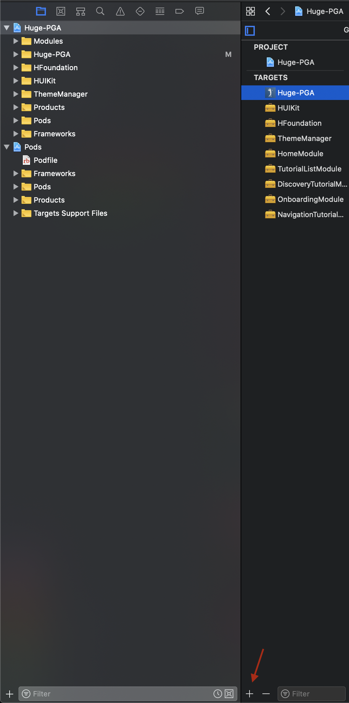

<p align="center">
  
</p>

---

# Installation

- Install the pods (Swift 3rd party libraries)
  - Install the _cocoapods_ ruby gem
    - https://guides.cocoapods.org/using/getting-started.html
    - Run the command `pod --version` in the Terminal to check if cocoa pods were installed
  - Run the _pod install_ command from the project directory
- Open the _.xcworkspace_ file
- Hit ⌘ + R to run the project

- Update MGLMapboxAccessToken in `Huge-PGA` [info.plist](https://stash.hugeinc.com/projects/HOAK/repos/pgatour-x-bose/browse/Huge-PGA/Resources/Info.plist)

# Main Concepts

## Entry Points

### Huge-PGA

- [AppDelegate](https://stash.hugeinc.com/projects/HOAK/repos/pgatour-x-bose/browse/Huge-PGA/AppDelegate.swift)
  - [AppDelegateRoutingEventsListener](https://stash.hugeinc.com/projects/HOAK/repos/pgatour-x-bose/browse/Huge-PGA/EventListeners/AppDelegateRoutingEventsListener.swift)
    - [TabBarControllerRouter](https://stash.hugeinc.com/projects/HOAK/repos/pgatour-x-bose/browse/Huge-PGA/Router/TabbarControllerRouter.swift)

### Modules

- [HomeModule](https://stash.hugeinc.com/projects/HOAK/repos/pgatour-x-bose/browse/Modules/HomeModule/HomeModule.swift)
  - [HomeSetup](https://stash.hugeinc.com/projects/HOAK/repos/pgatour-x-bose/browse/Huge-PGA/Routes/HomeSetup.swift)
    - [HomeListener](https://stash.hugeinc.com/projects/HOAK/repos/pgatour-x-bose/browse/Huge-PGA/EventListeners/MainRoutingListeners/HomeListener.swift)
- [TutorialListModule](https://stash.hugeinc.com/projects/HOAK/repos/pgatour-x-bose/browse/Modules/TutorialListModule/TutorialListModule.swift)
  - [TutorialListSetup](https://stash.hugeinc.com/projects/HOAK/repos/pgatour-x-bose/browse/Huge-PGA/Routes/TutorialListSetup.swift)
    - [TutorialListListener](https://stash.hugeinc.com/projects/HOAK/repos/pgatour-x-bose/browse/Huge-PGA/EventListeners/MainRoutingListeners/TutorialListListener.swift)
- [OnboardingModule](https://stash.hugeinc.com/projects/HOAK/repos/pgatour-x-bose/browse/Modules/OnboardingModule/OnboardingModule.swift)
  - [OnboardingSetup](https://stash.hugeinc.com/projects/HOAK/repos/pgatour-x-bose/browse/Huge-PGA/Routes/OnboardingSetup.swift)
    - [OnboardingListener](https://stash.hugeinc.com/projects/HOAK/repos/pgatour-x-bose/browse/Huge-PGA/EventListeners/MainRoutingListeners/OnboardingListener.swift)
- [DiscoveryTutorialModule](https://stash.hugeinc.com/projects/HOAK/repos/pgatour-x-bose/browse/Modules/DiscoveryTutorialModule/DiscoveryTutorialModule.swift)
  - [DiscoveryTutorialSetup](https://stash.hugeinc.com/projects/HOAK/repos/pgatour-x-bose/browse/Huge-PGA/Routes/DiscoveryTutorialSetup.swift)
    - [DiscoveryTutorialListener](https://stash.hugeinc.com/projects/HOAK/repos/pgatour-x-bose/browse/Huge-PGA/EventListeners/MainRoutingListeners/DiscoveryTutorialListener.swift)
- [NavigationTutorialModule](https://stash.hugeinc.com/projects/HOAK/repos/pgatour-x-bose/browse/Modules/NavigationTutorialModule/NavigationTutorialModule.swift)
  - [NavigationTutorialSetup](https://stash.hugeinc.com/projects/HOAK/repos/pgatour-x-bose/browse/Huge-PGA/Routes/NavigationTutorialSetup.swift)
    - [NavigationTutorialListener](https://stash.hugeinc.com/projects/HOAK/repos/pgatour-x-bose/browse/Huge-PGA/EventListeners/MainRoutingListeners/NavigationTutorialListener.swift)

### Module Events

- [Home Module](https://stash.hugeinc.com/projects/HOAK/repos/pgatour-x-bose/browse/Modules/HomeModule/HomeModule.swift#26)
  - findPlayerTapped
  - pointsOfInterestsTapped
- [TutorialListModule](https://stash.hugeinc.com/projects/HOAK/repos/pgatour-x-bose/browse/Modules/TutorialListModule/TutorialListModule.swift#26)
  - skip
  - discovery
  - navigation
- [OnboardingModule](https://stash.hugeinc.com/projects/HOAK/repos/pgatour-x-bose/browse/Modules/OnboardingModule/OnboardingModule.swift#30)
  - changedToType([OnboardingDatasourceType](https://stash.hugeinc.com/projects/HOAK/repos/pgatour-x-bose/browse/Modules/OnboardingModule/Onboarding/Model/OnboardingPage.swift#12))
  - actionTypeTapped([OnboardingDatasourceType](https://stash.hugeinc.com/projects/HOAK/repos/pgatour-x-bose/browse/Modules/OnboardingModule/Onboarding/Model/OnboardingPage.swift#12))
- [DiscoveryTutorialModule](https://stash.hugeinc.com/projects/HOAK/repos/pgatour-x-bose/browse/Modules/DiscoveryTutorialModule/DiscoveryTutorialModule.swift#26)
  - changedToType([DiscoveryTutorialType](https://stash.hugeinc.com/projects/HOAK/repos/pgatour-x-bose/browse/Modules/DiscoveryTutorialModule/DiscoveryTutorial/ViewModel/DiscoveryTutorialActions.swift#12))
- [NavigationTutorialModule](https://stash.hugeinc.com/projects/HOAK/repos/pgatour-x-bose/browse/Modules/NavigationTutorialModule/NavigationTutorialModule.swift#34)
  - changedToType([NavigatoinTutorialType](https://stash.hugeinc.com/projects/HOAK/repos/pgatour-x-bose/browse/Modules/NavigationTutorialModule/NavigationTutorialModule.swift#12))

### Global Events

- [WearableEventsListener](https://stash.hugeinc.com/projects/HOAK/repos/pgatour-x-bose/browse/HFoundation/BoserWearable/WearableManager.swift#19)
  - bluetoothStatusChanged(CBPeripheralManagerAuthorizationStatus)
- [WearableSessionEventsListener](https://stash.hugeinc.com/projects/HOAK/repos/pgatour-x-bose/browse/HFoundation/BoserWearable/WearableSessionManager.swift#18)
  - device(WearableDevice?)
  - event(WearableDeviceEvent)
  - sessionDidOpen
  - didClose(Error?)
  - didFailToOpen(Error)
  - receivedGesture(GestureType, SensorTimestamp)
  - receivedGyroscope(Vector, VectorAccuracy, SensorTimestamp)
  - receivedAccelerometer(Vector, VectorAccuracy, SensorTimestamp)
  - trueHeadingDegreesChanged(Double?)
  - receivedRotation(Quaternion, QuaternionAccuracy, SensorTimestamp)
- [LocationManagerEventsListener](https://stash.hugeinc.com/projects/HOAK/repos/pgatour-x-bose/browse/HFoundation/LocationManager/LocationManager.swift#15)
  - locationStatusChanged(CLAuthorizationStatus)

# Architecture

For architecture we chose to follow [event-driven architecture](https://en.wikipedia.org/wiki/Event-driven_architecture) and concept of [modularity](https://docs.swift.org/swift-book/LanguageGuide/AccessControl.html). [MERLin](https://github.com/gringoireDM/MERLin) is a perfect choice for such architecture and provides a lot of tools out of the box.

- **Modules** - https://github.com/gringoireDM/MERLin/wiki/Modules
- **Routing** - https://github.com/gringoireDM/MERLin/wiki/Routing
- **Listeners** https://github.com/gringoireDM/MERLin/wiki/Listeners

- Samples - https://github.com/gringoireDM/MERLin/tree/master/MERLinSample

# Networking

For networking we chose to use URL session and light abstration for separating usage of multiple APIs. We configuring adapters through baseURL and API path. We describe adapter networking requests through `RequestConfig` that consist of method type (GET, POST...) and path with optional parameters.

**Existing Adapters**

- [TournamentAdapter](https://stash.hugeinc.com/projects/HOAK/repos/pgatour-x-bose/browse/HFoundation/Networking/Adapters/TournamentAdapter.swift)
  - [fetch(id: Int)](https://stash.hugeinc.com/projects/HOAK/repos/pgatour-x-bose/browse/HFoundation/Networking/Adapters/TournamentAdapter.swift#29) - fetched tournament details by id

Example of use:

```swift
TournamentAdapter.fetch(id: 480)
.observeOn(MainScheduler.asyncInstance)
.subscribe(onNext: { [weak module] tournament in
print("[DEBUG] - tournament fetched - \(tournament)")
})
.disposed(by: disposeBag)
```

# Models

For decoding we use simple structures that comfort to `Decodable` protocol.

- [Tournament](https://stash.hugeinc.com/projects/HOAK/repos/pgatour-x-bose/browse/HFoundation/Networking/Models/Tournament.swift)
- [Event](https://stash.hugeinc.com/projects/HOAK/repos/pgatour-x-bose/browse/HFoundation/Networking/Models/Event.swift)
- [Course](https://stash.hugeinc.com/projects/HOAK/repos/pgatour-x-bose/browse/HFoundation/Networking/Models/Course.swift)
- [Round](https://stash.hugeinc.com/projects/HOAK/repos/pgatour-x-bose/browse/HFoundation/Networking/Models/Round.swift)
- [Group](https://stash.hugeinc.com/projects/HOAK/repos/pgatour-x-bose/browse/HFoundation/Networking/Models/Group.swift)
- [Player](https://stash.hugeinc.com/projects/HOAK/repos/pgatour-x-bose/browse/HFoundation/Networking/Models/Player.swift)

# Additinal Frameworks

We're using [BoseWearable SDK](https://github.com/Bose/BoseWearable-iOS/blob/master/docs/Usage.md) and wrapping main events that coming from sdk to singles, so that we maintain session and device events from listeners:

- [WearableSessionEventsListener.swift](https://stash.hugeinc.com/projects/HOAK/repos/pgatour-x-bose/browse/Huge-PGA/EventListeners/GlobalEventsListener/WearableSessionEventsListener.swift)
- [WearableEventsListener.swift](https://stash.hugeinc.com/projects/HOAK/repos/pgatour-x-bose/browse/Huge-PGA/EventListeners/GlobalEventsListener/WearableEventsListener.swift)

For routing we're using [Mapbox turn-by-turn navigation](https://www.mapbox.com/use-cases/turn-by-turn-navigation/).

- [Directions Manager](https://stash.hugeinc.com/projects/HOAK/repos/pgatour-x-bose/browse/HFoundation/Directions/DirectionsManager.swift) - Responsible for presenting MapboxUI and calculating routes.

## Further reading

We're using [SwiftFormat](https://github.com/nicklockwood/SwiftFormat) for code formatting (pre-commit hooks). [Installation guide](https://github.com/nicklockwood/SwiftFormat#command-line-tool).

[SwiftGen](https://github.com/SwiftGen/SwiftGen) was added in order to support code gen for assets & fonts. If you want to change scripts - please check `Build Phases` -> `swift gen` step

- events driven architecture - https://medium.com/better-programming/events-driven-architecture-in-ios-with-merlin-63d211e64698
- feedback loops - https://academy.realm.io/posts/try-swift-nyc-2017-krunoslav-zaher-modern-rxswift-architectures/
- enum kit - https://medium.com/better-programming/swift-enums-mind-the-gap-3573378d2d9f

## Mapping a golf course:

- https://blog.mapbox.com/golf-course-maps-fbfe40324cf7
- https://blog.mapbox.com/mapping-a-golf-course-4f5bc88ca59b
- https://docs.mapbox.com/ios/maps/overview/mapbox-studio/
- https://docs.mapbox.com/ios/maps/examples/custom-style/

# Examples

## Adding new global event listener

Create event producer - eg [LocationManager](https://stash.hugeinc.com/projects/HOAK/repos/pgatour-x-bose/browse/HFoundation/LocationManager/LocationManager.swift)

```swift
public enum LocationManagerEvents: EventProtocol {
    case locationStatusChanged(CLAuthorizationStatus)
}


public var events: Observable<LocationManagerEvents> { return _events }
private let _events = PublishSubject<LocationManagerEvents>()
```

1. Add event listener to the main app - https://stash.hugeinc.com/projects/HOAK/repos/pgatour-x-bose/browse/Huge-PGA/EventListeners/GlobalEventsListenerAggregator.swift#23

Please note that we created `GlobalEventsListenerAggregator` to combine multiple streams into one call that's happening here - https://stash.hugeinc.com/projects/HOAK/repos/pgatour-x-bose/browse/Huge-PGA/AppDelegate.swift#51

2. Add [LocationManagerListener](https://stash.hugeinc.com/projects/HOAK/repos/pgatour-x-bose/browse/Huge-PGA/EventListeners/GlobalEventsListener/LocationManagerEventsListener.swift) and add observers for events described above:

```swift
    func listenEvents(from producer: AnyEventsProducer,
                      events: Observable<LocationManagerEvents>) -> Bool {
        producer.capture(event: LocationManagerEvents.locationStatusChanged)
            .toRoutableObservable()
            .subscribe(onNext: { status in
                print("[DEBUG] - location status changed - \(status.rawValue)")
            })
            .disposed(by: producer.disposeBag)

        return true
    }
```

Please note that if you change Observable type from `Observable<LocationManagerEvents>` to something else this listener won't trigger since we define events in manager.

```swift
public var events: Observable<LocationManagerEvents> { return _events }
private let _events = PublishSubject<LocationManagerEvents>()
```

## Adding new module

1. Go to your project targets and add new one:

<p align="left">
  
</p>

2. Create Framework

<p align="left">
  
</p>

Note: New module will be added to rood directory - you can move it to `Modules` folder for consistency. Also be sure to change `iOS Deployment Target` and `Info.plist file` location in `Build settings` for newly created framework.

Add HFoundation to module dependencies - `Build Phases` -> `Dependencies`.

3. Create module logic - suggesion would be to follow examples from already created modules. We don't necessarily want to follow them strictly, but that provides a lot of tools out of the box (eg - logging / deeplinking) - https://github.com/gringoireDM/MERLin/wiki/Deeplinking

Note: Suggesion would be to create Module with empty `unmanagedRootViewController()-> UIViewController`, then start with actions -> state -> viewModel and then you can switch to view.

For example we're going to work on [TutorialListModule](https://stash.hugeinc.com/projects/HOAK/repos/pgatour-x-bose/browse/Modules/TutorialListModule).

First start `TutorialListModuleContext` that can help us with deeplinks.

```swift
public class TutorialListModuleContext: ModuleContextProtocol {
    public typealias ModuleType = TutorialListModule
    public var routingContext: String

    public init(routingContext: String) {
        self.routingContext = routingContext
    }

    public func make() -> (AnyModule, UIViewController) {
        let module = ModuleType(usingContext: self)
        return (module, module.prepareRootViewController())
    }
}
```

After that we want to define actions that module can pass to the main app, which is going to be:

```swift
public enum TutorialActionType {
    case skip
    case discovery
    case navigation
}

public enum TutorialListModuleEvents: EventProtocol {
    case actionTypeTapped(TutorialActionType)
}
```

And then we can describe out module with those events:

```swift
public class TutorialListModule: ModuleProtocol, EventsProducer {
    public var events: Observable<TutorialListModuleEvents> { return _events.asObservable() }
    private var _events = PublishSubject<TutorialListModuleEvents>()

    public var context: TutorialListModuleContext

    public required init(usingContext buildContext: TutorialListModuleContext) {
        context = buildContext
    }

    public func unmanagedRootViewController() -> UIViewController {
        ...
    }
}
```

Note - `unmanagedRootViewController` represents view controller that's going to be handled to our application.

After that we need to define our `Movel` `ViewMovel` and `View` - [MVVM](https://en.wikipedia.org/wiki/Model%E2%80%93view%E2%80%93viewmodel)

For model we can simply take following struct that's already populated

- [TutorialListModel.swift](https://stash.hugeinc.com/projects/HOAK/repos/pgatour-x-bose/browse/Modules/TutorialListModule/TutorialList/Model/TutorialListModel.swift)

For Actions(UI and Model) we want to define what are the inputs from our UI or Model that can change our state.

- [TutorialListActions.swift](https://stash.hugeinc.com/projects/HOAK/repos/pgatour-x-bose/browse/Modules/TutorialListModule/TutorialList/ViewModel/TutorialListActions.swift)

In [TutorialListState.swift](https://stash.hugeinc.com/projects/HOAK/repos/pgatour-x-bose/browse/Modules/TutorialListModule/TutorialList/ViewModel/TutorialListState.swift) we are describing what are the states in our module. Also it includes two reducers (UI and Module), but in this example they don't change states.

In [TutorialListViewModel.swift](https://stash.hugeinc.com/projects/HOAK/repos/pgatour-x-bose/browse/Modules/TutorialListModule/TutorialList/ViewModel/TutorialListViewModel.swift) we combining our actions in [feedback loop](https://academy.realm.io/posts/try-swift-nyc-2017-krunoslav-zaher-modern-rxswift-architectures/) and providing side effect (which is call outside of module) when specific events is happening.

And in [TutorialListViewController.swift](https://stash.hugeinc.com/projects/HOAK/repos/pgatour-x-bose/browse/Modules/TutorialListModule/TutorialList/View/TutorialListViewController.swift) we defining our UI logic and binding events that coming from them here - https://stash.hugeinc.com/projects/HOAK/repos/pgatour-x-bose/browse/Modules/TutorialListModule/TutorialList/View/TutorialListViewController.swift#127

So our `TutorialListModule.swift -> unmanagedRootViewController()..` is going to change to

```swift
    public func unmanagedRootViewController() -> UIViewController {
        let model = TutorialListModel()
        let viewModel = TutorialListViewModel(model: model,
                                              events: _events)
        let view = TutorialListViewController(with: viewModel)
        return view
    }
```

Note that we can completely ignore feedback loops since in provided Use-Case it won't makes a lot of sence to write that (because we don't have model or UI that can change our state) but if there's going to be a requirement to change one of the modules we can already do that pretty easily.

4. Add module step with events

# TODO:

- [calculated](https://stash.hugeinc.com/projects/HOAK/repos/pgatour-x-bose/browse/HFoundation/BoserWearable/WearableSessionManager.swift#72) rotation degree of wearable, need to calculate if current user `trueHeadingDegrees` is within a range.

- Add text to speech synthesizer with text coming from interest model -

Multiple approaches:

1. Using Apple's [AVSpeechSynthesizer](https://developer.apple.com/documentation/avfoundation/avspeechsynthesizer)

```swift
/// Wait for sygnal to trigger text-to-speech
var speechSynthesizer = AVSpeechSynthesizer()

var speechUtterance: AVSpeechUtterance = AVSpeechUtterance(string: <Interest.details>)
speechUtterance.voice = AVSpeechSynthesisVoice(language: “en-US”)

speechSynthesizer.speakUtterance(speechUtterance)

speechUtterance.rate = AVSpeechUtteranceMaximumSpeechRate / 4.0
```

2. Using [MapboxVoiceController](https://docs.mapbox.com/ios/api/navigation/0.37.0/Classes/MapboxVoiceController.html#/MapboxVoiceController)
   They're using [Amazon Polly](https://blog.mapbox.com/turn-by-turn-voice-guidance-upgraded-to-amazon-polly-27734cf4a6e8)

```swift
let instruction = SpokenInstruction(
    distanceAlongStep: 0,
    text: "Approaching a high-demand zone.",
    ssmlText: "<speak>Approaching a <prosody pitch='high'>high-demand</prosody> zone.</speak>")
navigationViewController.voiceController.speak(instruction)
```

Resourse - https://blog.mapbox.com/custom-voice-instructions-for-navigation-5052a6ffc032

Or we can subclass entirve VoiceController in order to have full control over the system - https://github.com/mapbox/navigation-ios-examples/blob/master/Navigation-Examples/Examples/Custom-Voice-Controller.swift
